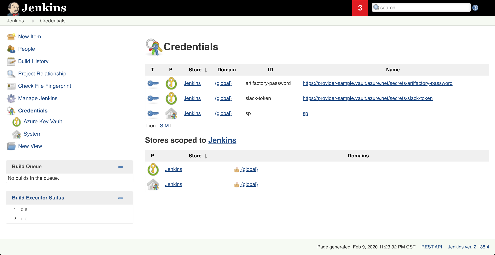

# Azure Key Vault Plugin

[![Build Status][jenkins-status]][jenkins-builds]
[![Jenkins Plugin][plugin-version-badge]][plugin]
[![GitHub release][github-release-badge]][github-release]
[![Jenkins Plugin Installs][plugin-install-badge]][plugin]

This plugin enables Jenkins to fetch secrets from Azure Keyvault and inject them directly into build jobs.
It works similarly to the [Credential Binding Plugin](https://plugins.jenkins.io/credentials-binding/) and borrows much from the [Hashicorp Vault Plugin](https://plugins.jenkins.io/hashicorp-vault-plugin/).
The plugin acts as an Azure Active Directory Application and must be configured with a valid credential. Additional details [here](https://docs.microsoft.com/en-us/azure/app-service-mobile/app-service-mobile-how-to-configure-active-directory-authentication#optional-configure-a-native-client-application).

## System Configuration

### Via UI

In the Jenkins **Configure System** page, configure the following two options in the **Azure Key Vault Plugin** section
* **Key Vault URL** - The url where your keyvault resides (e.g. `https://myvault.vault.azure.net/`)
* **Credential ID** - The ID associated with a secret in the Jenkins secret store. Supported types are: 
    - **Microsoft Azure Service Principal**
    - **Managed Identities for Azure Resources**

### Via configuration-as-code

This plugin supports the [configuration as code](https://github.com/jenkinsci/configuration-as-code-plugin/) plugin:

Example yaml:
```yaml
credentials:
  system:
    domainCredentials:
      - credentials:
        - azure:
            azureEnvironmentName: "Azure"
            clientId: "d63d9de6-5f7a-48c1-ac1d-e90d4f5e5dcc"
            clientSecret: "${CLIENT_SECRET}"
            description: "An azure service principal"
            id: "service-principal"
            scope: SYSTEM
            subscriptionId: "d63d9de6-5f7a-48c1-ac1d-e90d4f5e5dcc"
            tenant: "d63d9de6-5f7a-48c1-ac1d-e90d4f5e5dcc"

unclassified:
  azureKeyVault:
    keyVaultURL: https://not-a-real-vault.vault.azure.net
    credentialID: service-principal
```

### Via system properties

URL:

```bash
-Djenkins.azure-keyvault.url=https://my.vault.azure.net
```

User Assigned Managed Identity or System Assigned Identity:

```bash
-Djenkins.azure-keyvault.uami.enabled=true
```

Service principal:

```bash
-Djenkins.azure-keyvault.sp.client_id=...
-Djenkins.azure-keyvault.sp.client_secret=...
-Djenkins.azure-keyvault.sp.subscription_id=...
-Djenkins.azure-keyvault.sp.tenant_id=...
```

### Via environment variables

URL:

```bash
AZURE_KEYVAULT_URL=https://my.vault.azure.net
```

User Assigned Managed Identity or System Assigned Identity:

```bash
AZURE_KEYVAULT_UAMI_ENABLED=true
```

Service principal:

```bash
AZURE_KEYVAULT_SP_CLIENT_ID=...
AZURE_KEYVAULT_SP_CLIENT_SECRET=...
AZURE_KEYVAULT_SP_SUBSCRIPTION_ID=...
AZURE_KEYVAULT_SP_TENANT_ID=...
```

## Building the Plugin
* Run **mvn package**, an .hpi file will be generated in the target folder.

## Plugin Usage
### Usage in Jenkinsfile
Note that the example echos below will only show *****'s as the plugin redacts secrets found in the build log inside the
`withAzureKeyvault` build wrapper.

#### Scripted
Snippet generator is fully supported for generating the possible values (along with inline help):
Go to any pipeline job and click `Pipeline Syntax`

Or visit the URL: `/job/<job-name>/pipeline-syntax/`

Simple version:
```groovy
node {
    def secrets = [
        [ secretType: 'Certificate', name: 'MyCert00', envVariable: 'CERTIFICATE' ],
        [ secretType: 'Secret', name: 'MySecret00', envVariable: 'SECRET' ],
        [ secretType: 'Secret', name: 'MySecret00', version: '342432lkjhdasjld', envVariable: 'SECRET' ]
    ]

    withAzureKeyvault(secrets) {
        sh 'echo $CERTIFICATE'
        sh 'echo $SECRET'
    }
}

```

With overrides:
```groovy
static LinkedHashMap<String, Object> secret(String secretName, String envVar) {
  [ 
    secretType: 'Secret',
    name: secretName,
    version: '342432lkjhdasjld',
    envVariable: envVar
  ]
}

node {
    def secrets = [
        secret('my-secret', 'MY_SECRET')
    ]

    withAzureKeyvault(
            azureKeyVaultSecrets: secrets, 
            keyVaultURLOverride: 'https://mykeyvault.vault.azure.net',
            credentialIDOverride: 'service-principal'
    ) {
        sh 'echo $MY_SECRET'
     }
}
```

#### Declarative
Snippet generator is fully supported for generating the possible values (along with inline help):
Go to any pipeline job and click `Pipeline Syntax` -> `Declarative Directive Generator`

Or visit the URL: `/job/<job-name>/directive-generator/`


Simple:
```groovy
pipeline {
    agent any
    stages {
        stage('Build') {
            options {
              azureKeyVault([[envVariable: 'MY_SECRET', name: 'my-secret', secretType: 'Secret']])
            }
            steps {
                sh "echo $SECRET"
            }
        }
    }
}
```

With overrides:
```groovy
pipeline {
    agent any
    stages {
        stage('Build') {
            options {
              azureKeyVault(
                credentialID: 'my-sp', 
                keyVaultURL: 'https://my.vault.azure.net', 
                secrets: [
                    [envVariable: 'MY_SECRET', name: 'my-secret', secretType: 'Secret']
                ]
              )
            }
            steps {
                sh "echo $SECRET"
            }
        }
    }
}
```

Certificate:
```groovy
pipeline {
    agent any
    stages {
        stage('Build') {
            options {
              azureKeyVault([[envVariable: 'CERT_LOCATION', name: 'my-cert-name', secretType: 'Certificate']])
            }
            steps {
                sh "openssl pkcs12 -in $CERT_LOCATION  -nodes -password 'pass:' -out keyvault.pem"
            }
        }
    }
}
```

The shell command above will convert the PFX file to a pem key file (also containing the cert), note that Azure Key Vault removes the password
on the pfx when you import it, if you're importing it back into Azure somewhere else you may need to convert it to pem and convert back to a pfx with a password.

### Azure Key Vault Credentials Provider (Beta)

This plugin also enables the retrieval of Secrets directly from Azure Key Vault. After the configuration is set up, secrets from the key vault can 
be viewed in the credentials page like this:



*Note* These credentials are read-only and metadata caching(5 minutes) which means newly created secrets may not be here immediately.

Use these credentials just as other normal credentials in Jenkins.

Declarative Pipeline:

```groovy
pipeline {
    agent any
    environment {
        GITHUB_API_TOKEN = credentials('github-api-token')
    }
    stages {
        stage('Foo') {
            steps {
                echo '$GITHUB_API_TOKEN'
            }
        }
    }
}
```

Scripted Pipeline:

```groovy
node {
    withCredentials([string(credentialsId: 'github-api-token', variable: 'GITHUB_API_TOKEN')]) {
        echo '$GITHUB_API_TOKEN'
    }
}
```

It is also possible to use it as a UsernamePassword credentials, to do so, tag the secret with the desired `username`:  
```bash
az keyvault secret set --vault-name my-vault --name github-pat --value my-pat --tags username=github-user
```

Scripted Pipeline:  
```groovy
job('my example') {
    scm {
        git {
            remote {
                github('my-repo', 'https')
                credentials('github-pat')
            }
        }
    }
}
```

### SecretSource

The plugin allows JCasC to interpolate string secrets from Azure KeyVault.

#### Example

az cli:

```bash
az keyvault secret set --vault-name my-vault --name my-password --value password
```

JCasC:

```yaml
jenkins:
  securityRealm:
    local:
      allowsSignup: false
      users:
      - id: "foo"
        password: "${my-password}"
```

[jenkins-builds]: https://ci.jenkins.io/job/Plugins/job/azure-keyvault-plugin/job/master/
[jenkins-status]: https://ci.jenkins.io/buildStatus/icon?job=Plugins/azure-keyvault-plugin/master
[plugin-version-badge]: https://img.shields.io/jenkins/plugin/v/azure-keyvault.svg
[plugin-install-badge]: https://img.shields.io/jenkins/plugin/i/azure-keyvault.svg?color=blue
[plugin]: https://plugins.jenkins.io/azure-keyvault
[github-release-badge]: https://img.shields.io/github/release/jenkinsci/azure-keyvault-plugin.svg?label=release
[github-release]: https://github.com/jenkinsci/azure-keyvault-plugin/releases/latest
